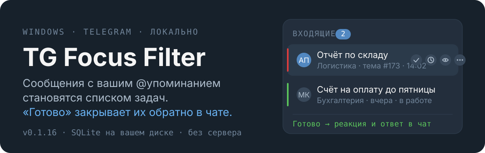
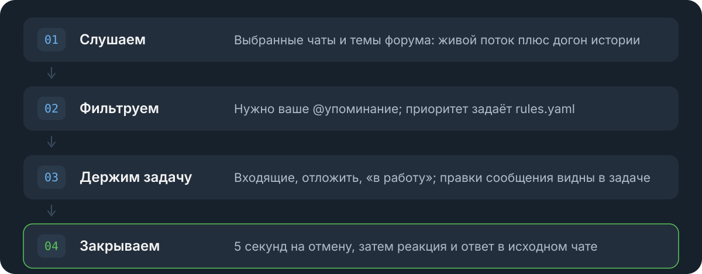

<p align="center">
  
</p>

Рабочие чаты Telegram шумят, а задачи в них теряются. **TG Focus Filter** слушает только выбранные чаты и темы, оставляет сообщения, где упомянули вас, и показывает их списком. Нажали «Готово» — приложение само поставит реакцию и ответит в исходном сообщении.

Всё работает на вашем компьютере: база SQLite лежит рядом с приложением, никакого сервера и облака.

<p align="center">
  
</p>

## Что умеет

| | |
|---|---|
| **Входящие** | Задача из сообщения: автор, чат, тема форума, время, вложение |
| **Готово** | 5 секунд на отмену, потом реакция (по умолчанию 👍) и ответ «Готово ✅» |
| **Свой ответ** | Вместо стандартного текста можно отправить свой |
| **Отложить** | Задача уходит из списка и возвращается в срок |
| **В работу** | Отметка «занимаюсь» + реакция 👀 в чате |
| **Правки** | Автор отредактировал сообщение — задача обновляется, метка «изменено» |
| **Догон** | Сканирование истории за последние часы после запуска (по желанию) |
| **Защита** | PIN на вход, сессия Telegram зашифрована средствами Windows (DPAPI) |
| **Статистика** | Задачи по дням, чатам, темам и приоритетам |
| **Обновления** | Проверка и установка новой версии прямо из приложения |

## Чем отличается от «ещё одного тудушника»

- **Задача рождается в чате и умирает в чате.** Закрытая задача не остаётся вашей личной тайной: коллега видит реакцию и ответ на своё сообщение.
- **Строгие упоминания.** Задача создаётся только там, где есть ваш `@handle` — ни одного «на всякий случай».
- **Окно отмены.** Реакция уходит не мгновенно, а через 5 секунд: ошибочное «Готово» ещё можно вернуть.
- **Правила, а не настройки на все случаи жизни.** Приоритет и исключения описываются в YAML.
- **Ничего не уезжает наружу.** Telegram — единственная внешняя связь.

## Быстрый старт

1. Скачайте `TG-Focus-Filter-*-setup.exe` со страницы релизов (`*-portable.exe` — если не нужны автообновления).
2. Запустите и пройдите вход в Telegram: телефон → код → пароль 2FA.
3. В настройках укажите свой `@handle` и отметьте чаты и темы, которые слушаем.
4. Попросите коллегу упомянуть вас — сообщение появится во «Входящих».

Подробно: [docs/SETUP.md](docs/SETUP.md) и [docs/AUTH_GUIDE.md](docs/AUTH_GUIDE.md).

## Правила

Фильтр слушателя (упоминание, чаты, темы) настраивается в приложении. Тонкая настройка — в [shared/rules/default_rules.yaml](shared/rules/default_rules.yaml): правила проверяются по убыванию приоритета, побеждает первое совпавшее.

```yaml
- id: urgent_words
  name: Срочные слова
  enabled: true
  priority: 200
  when:
    keywords: ["срочно", "asap", "горит"]
  then:
    create_task: true
    priority: high
```

Условия `when`: `mention`, `keywords`, `chat_id`, `thread_id` — объединяются по «И».

## Сборка из исходников

```powershell
build.bat all patch     # собрать installer + portable и поднять patch-версию
build.bat nsis 0.2.0    # installer с конкретной версией
build.bat portable none # portable без смены версии
```

Разработка, тесты и структура сборки: [docs/DEVELOPMENT.md](docs/DEVELOPMENT.md).

## Устройство

| Слой | Технологии |
|---|---|
| Интерфейс | Electron 40, React 18, TypeScript, Tailwind |
| Логика | Python 3.13, FastAPI, SQLAlchemy, SQLite |
| Telegram | Telethon (вход под вашим аккаунтом) |
| Сборка | PyInstaller + electron-builder |
| Доставка | GitHub Actions по тегу `v*` |

```text
apps/desktop/        Electron + React UI
services/api/        FastAPI, воркеры (слушатель, догон, отмена, отложить, чистка)
shared/rules/        YAML-правила
docs/                установка, авторизация, разработка, релизы, планы
build.bat            сборка одной командой
```

## Ограничения

- Только Windows.
- Автообновление работает у версии, поставленной установщиком; portable обновляется вручную.
- Вход выполняется под вашим аккаунтом Telegram (Telethon), бот не используется.
- Задача создаётся только по упоминанию — молчаливые поручения без `@` не попадут в список.
- Догон истории после запуска выключен по умолчанию.

## Документация

- [docs/SETUP.md](docs/SETUP.md) — установка и первый запуск
- [docs/AUTH_GUIDE.md](docs/AUTH_GUIDE.md) — вход в Telegram
- [docs/DEVELOPMENT.md](docs/DEVELOPMENT.md) — разработка, сборка, тесты
- [docs/RELEASE_AND_UPDATES.md](docs/RELEASE_AND_UPDATES.md) — релизы и автообновление
- [docs/ROADMAP.md](docs/ROADMAP.md) — что планируется дальше
- [BIG-PICTURE.md](BIG-PICTURE.md) — общая картина проекта
